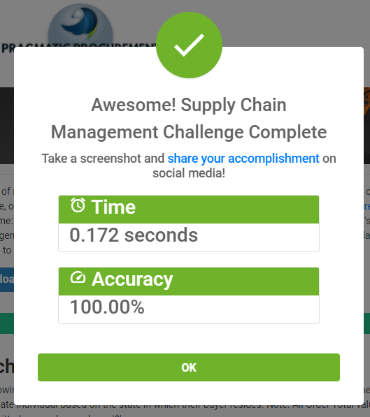
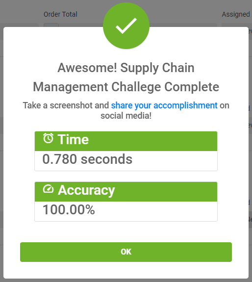
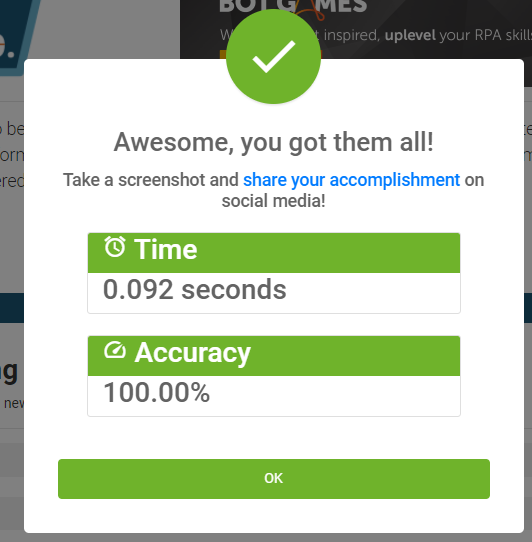
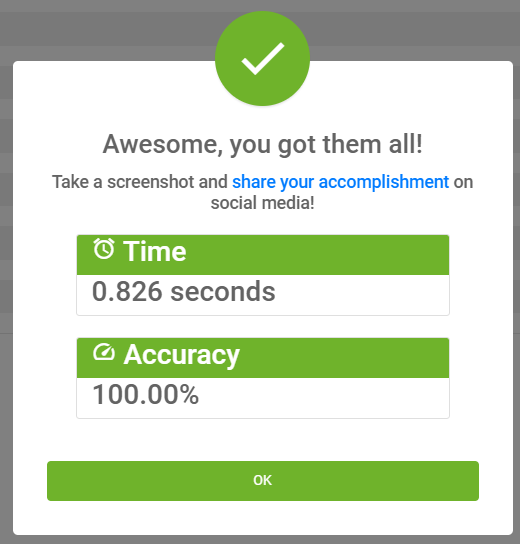

**Automation Anywhere challenge**

[Ken Soh](https://www.linkedin.com/in/kensoh) challenged me in a [linked post](https://www.linkedin.com/feed/update/urn:li:activity:6828014998061756416/), to solve the [automation anywhere](https://developer.automationanywhere.com/blog/challenge-page-intro-front-office) [challenge](https://developer.automationanywhere.com/challenges/automationanywherelabs-customeronboarding.html), so here is the result

I made a normal recording filling out the form.

I then made a scripted version to see if I could speed it up, but turn out with my hardware, its about the same either way.

**botwars week2**

Scripted

Normal

**botwars week1**

Enjoy

Scripted

Normal

