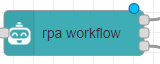
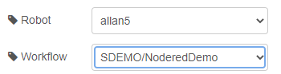

**Sending data from nodered to the robot and getting data back**

First import the NoderedDemo file into the robot and save it

Next go to nodered, click the menu icon

and click import

click select file and choose nodered-flows.json

and then click import

double click rpa workflow

and select your username and select the workflow you imported to the robot before

