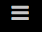
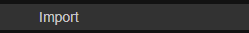
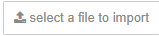
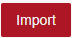

**Sending data from nodered to the robot and getting data back**

Download REST-response.xaml and flows.json

First import the REST-response.xaml file into the robot and save it

Next go to nodered, click the menu icon

and click import

click select file and choose flows.json

and then click import

double click rpa workflow

and select your username and select the workflow you imported to the robot before

Now you can call the robot using your nodered endpoint

So if your nodered is at https://username.app.openiap.io/ then your rest endpoint is at https://username.app.openiap.io/robot
and you send an argument with https://username.app.openiap.io/robot?arg1=Hi%20from%20rest

