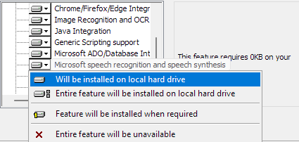
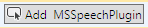

**Microsoft Speech example**

Simple workflow that responds to different voice commands.

Make sure to install the microsoft speech extension ( open the openrpa msi installer)



Open the robot, go to settings, then detectors and add a new voice detector



Under commands, add the following list of commands

```
open
robot
openflow
openrpa
search for
window
shoes
i love you
node red
close
goodbye
```

Import the Speach Example.xaml and select the detector you just created in the "Detector" activity


Then click Play to test your new voice controlled robot/workflow. 
