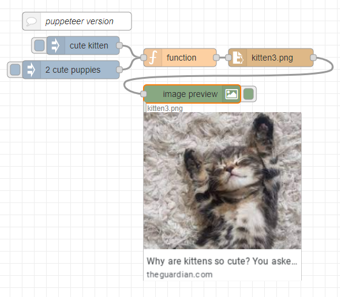

**Using puppeteer in nodered**

Select the "Latest Puppeteer Nodered" image
Enable function external modules
install node-red-contrib-image-output
Then import image_search.json
Enjoy the cute kitten picture

