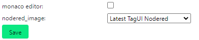
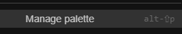
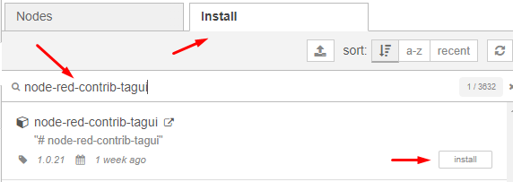
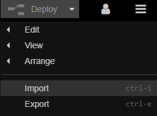
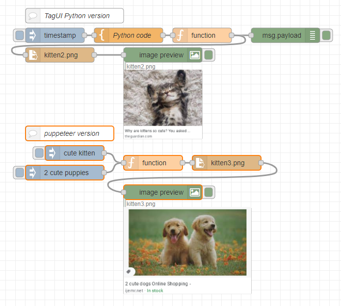

**Using TagUI in nodered**

Select the "Latest TagUI Nodered" image

Enable function external modules
install node-red-contrib-image-output and node-red-contrib-tagui under palette

Then import image_search.json

Click one one of the inject button and enjoy the cute kitten picture

